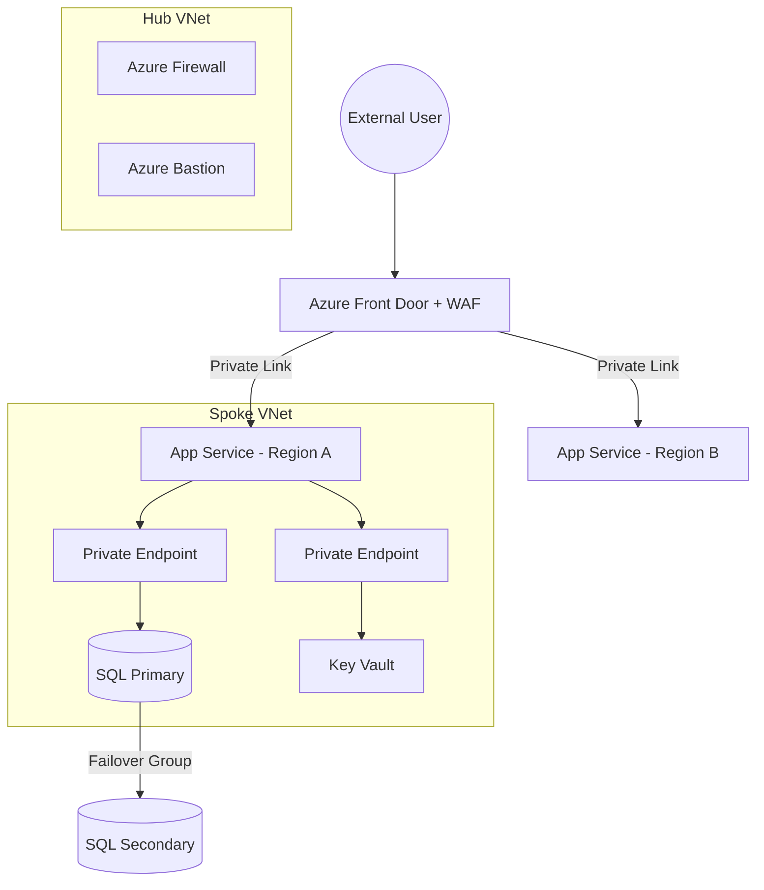

# 🏁 Final Project: The Secure Customer Portal (Enterprise Edition)

### *A Multi-Stage Architectural Evolution: From "Legacy" to "Cloud-Native"*

This capstone project simulates the real-world transformation of a legacy workload into a hardened, globally distributed, and governed enterprise platform, aligning with **NZ ISM** and **Cloud Security Alliance (CSA)** best practices.

---

## 🎯 The Scenario

A client needs a **Customer Portal** (Web App + SQL Database).

- **The Problem:** The initial MVP was built without architectural oversight. It has public endpoints, cleartext secrets, and a high risk of lateral movement.
- **The Mission:** Re-engineer the solution using a **Hub-and-Spoke** model to meet Enterprise Standards for **Security (AZ-500)**, **Identity (SC-300)**, and **Architecture (AZ-305)**.

---

## 🧩 Phase 1: The Foundation (AZ-104)

### *"Function over Form"*

**Objective:** Establish the baseline environment.

- **Tasks:** Deploy Azure App Service (Linux) and Azure SQL Database (vCore-based for scalability).
- **Technical Debt:** Document the "As-Is" state, highlighting risks like `0.0.0.0/0` firewall rules and the lack of encryption-at-rest oversight.

---

## 🛡️ Phase 2: Zero-Trust & Identity (SC-300 & AZ-500)

### *"Identity is the New Perimeter"*

**Objective:** Implement strict access control and network isolation.

- **Challenge 1 — Private Link & Hub Integration:** Move the App into a Spoke VNet. Use **Private Endpoints** for SQL and Key Vault. Ensure no public IP exists on any PaaS service.
- **Challenge 2 — Passwordless Identity (Your Speciality):**
  - Disable SQL Authentication entirely.
  - Implement **Entra ID Authentication** for Azure SQL using the App Service's **Managed Identity**.
- **Challenge 3 — Privileged Access:** Implement **Privileged Identity Management (PIM)** for the "Contributor" roles on the production Resource Group.
- **Challenge 4 — Defender for Cloud:** Enable **Defender for SQL** and **Defender for App Service**. Simulate a "SQL Injection" and use the **Security Graph** to visualize the attack path.

---

## 🧠 Phase 3: Resiliency & Global Reach (AZ-305)

### *"Design for Failure"*

**Objective:** Ensure the portal survives a regional outage (e.g., Australia East to Australia Southeast).

- **Challenge 1 — Global HA:** Deploy a secondary region via Bicep. Use **SQL Auto-Failover Groups** with a read-scale replica.
- **Challenge 2 — Layer 7 Security:** Deploy **Azure Front Door Premium** with **WAF**. Use **Private Link Service** so Front Door reaches the App Service backend without traversing the public internet.
- **Challenge 3 — Cost Optimization:** Leverage your CV's "60% savings" claim by implementing **Azure Reserved Instances** and **Autoscaling** logic in the Bicep templates.

---

## 🧪 Phase 4: Governance & Compliance (SC-400)

### *"Operational Excellence at Scale"*

**Objective:** Automate "Guardrails" so developers cannot break the security posture.

- **Governance as Code:** Use **Azure Policy** to enforce:
  - **CMK (Customer Managed Keys)** for SQL encryption (SC-400 focus).
  - Mandatory **Resource Tags** for cost center tracking.
  - Prevention of any VNet peering outside the Hub-Spoke hierarchy.
- **Observability:** Centralize all telemetry in **Log Analytics**. Create a **KQL-based Workbook** that calculates the "Service Availability" and "Security Compliance Score" in real-time.

---

## 📐 Final Architecture



---

## 📂 Updated Repository Structure

```text
Final-Project/
├── 01-Infrastructure/       # Bicep: Hub-Spoke, VNets, Peering
├── 02-Security/             # Bicep: Private Link, Managed Identity, PIM
├── 03-Resiliency/           # Bicep: Front Door, SQL Failover Groups
├── 04-Governance/           # Custom Azure Policy & KQL Workbooks
├── scripts/                 # PowerShell/Graph API for Automated Compliance
└── Portfolio-Report.md      # Executive Summary of Security/Cost outcomes
```

---

## 🏆 Senior-Level Success Criteria

1. **Zero Trust:** All public access to the DB and App backend is blocked at the network and identity layers.
2. **IaC Maturity:** The entire 2-region environment can be stood up or torn down with a single Bicep command.
3. **Audit Readiness:** Provide a generated PDF report (via PowerShell/Graph API) showing 100% compliance with your custom Azure Policies.
